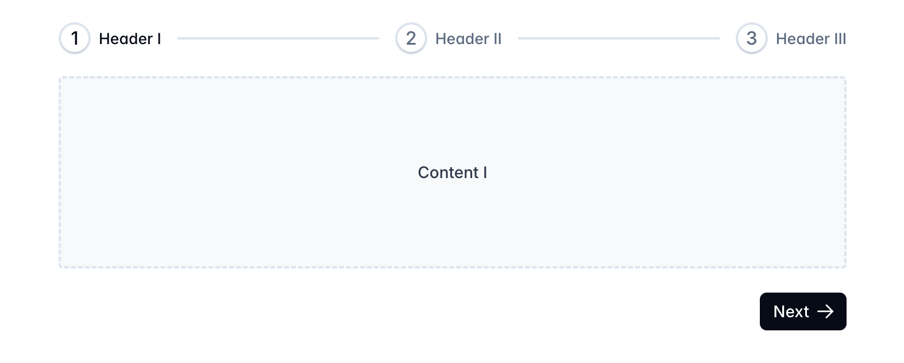

# Stepper Component Task

Your objective is to implement a **Stepper Component** based on the provided design.

## Table of Contents

- [Stepper Component Task](#stepper-component-task)
  - [Table of Contents](#table-of-contents)
  - [Task Description](#task-description)
  - [Design Reference](#design-reference)
  - [Requirements](#requirements)
    - [Functional Requirements](#functional-requirements)
    - [Technical Requirements](#technical-requirements)

## Task Description

Create a **Stepper Component** that guides users through a multi-step process. The component should clearly indicate each step and allow users to navigate between them seamlessly.

## Design Reference

Please refer to the design below to ensure your component aligns with the expected UI:

## Requirements

### Functional Requirements

1. **Responsive Design**
   - The component must adapt smoothly to various screen sizes, including mobile, tablet, and desktop.

2. **Dynamic Steps**
   - Support a dynamic number of steps, allowing flexibility in different use cases.

3. **Navigation**
   - Users should be able to move forward and backward between steps.
   - Indicate completion or validation states for each step as specified in the design.

### Technical Requirements

- **Framework**
  - Use **Vue 3** with the Composition API. Alternatively, you may choose another modern JavaScript framework if preferred.

- **Styling**
  - Utilize CSS, SCSS, or TailwindCSS to match the design accurately.

- **State Management**
  - Manage component state locally or use a state management library like Vuex or Pinia if necessary.

- **Animations**
  - Implement smooth transitions between steps as outlined in the design.

